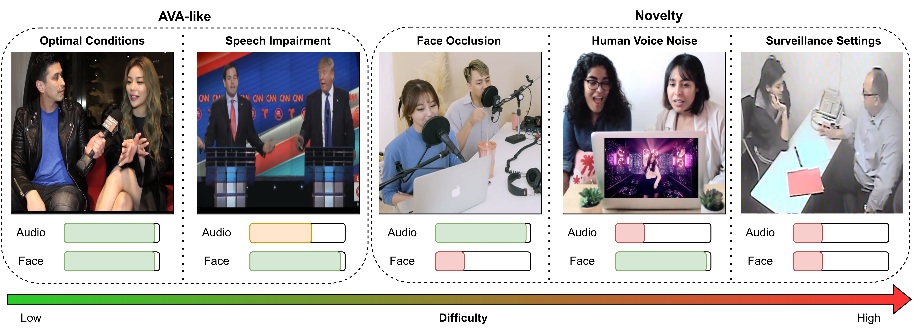

# Wilder Active Speaker Detection (WASD) Dataset ([Paper](https://arxiv.org/pdf/2303.05321.pdf))

*To view further details about WASD go to [dataset website](https://tiago-roxo.github.io/WASD/)*

**Wilder Active Speaker Detection (WASD)** dataset has increased difficulty by targeting the two key components of current Active Speaker Detection: audio and face. Grouped into **5 categories**, ranging from optimal conditions to surveillance settings, WASD contains incremental challenges for Active Speaker Detection with tactical impairment of audio and face data. 


*Considered categories of WASD, with relative audio and face quality represented. Categories range from low (Optimal Conditions) to high (Surveillance Settings) ASD difficulty by varying audio and face quality. Easier categories contain similar characteristics to AVA-ActiveSpeaker (AVA-like), while harder ones are the novelty of WASD.*


## Categories

*   **Optimal Conditions**: People talking in an alternate manner, with minor interruptions, cooperative poses, and face availability;


*   **Speech Impairment**: Frontal pose subjects either talking via video conference call (Delayed Speech) or in a heated discussion, with potential talking overlap (Speech Overlap), but ensuring face availability;


*   **Face Occlusion**: People talking with at least one of the subjects having partial facial occlusion, while keeping good speech quality (no delayed speech and minor communication overlap);


*   **Human Voice Noise**: Communication between speakers where another human voice is playing in the background, with face availability and subject cooperation ensured;


*   **Surveillance Settings**: Speaker communication in scenarios of video surveillance, with varying audio and image quality, without any guarantee of face access, speech quality, or subject cooperation.


## State-of-the-art Results

### Models Trained on AVA-ActiveSpeaker
Comparison of AVA-ActiveSpeaker trained state-of-the-art models on AVA-ActiveSpeaker and categories of WASD, using the mAP metric. We train and evaluate each model following the authors’ implementation. OC refers to Optimal Conditions, SI to Speech Impairment, FO to Face Occulsion, HVN to Human Voice Noise, and SS to Surveillance Settings. AVA refers to AVA-ActiveSpeaker.

| Model                                                        | AVA       | OC        | SI        | FO        | HVN       | SS        | All       | Pretrained |
|:-------------------------------------------------------------|:---------:|:---------:|:---------:|:---------:|:---------:|:---------:|:---------:|:----------:|
| [ASC](https://github.com/fuankarion/active-speakers-context) | 83.6      | 86.4      | 84.8      | 69.9      | 66.4      | 51.1      | 74.6      | [Download](https://drive.google.com/file/d/12Gnq-Wg0iWK4xCBpkdAXzOXSXJDqcC1f/view?usp=drivesdk)   |
| [MAAS](https://github.com/fuankarion/MAAS)                   | 82.0      | 83.3      | 81.3      | 68.6      | 65.6      | 46.0      | 70.7      | [Download](https://drive.google.com/file/d/1Wm4mNJSWAthpoiD-Q0fJTKcUeq9hMExm/view?usp=drivesdk)   |
| [ASDNet](https://github.com/okankop/ASDNet)                  | 91.1      | 91.1      | 90.4      | 78.2      | 74.9      | 48.1      | 79.2      | [Download](https://drive.google.com/file/d/1ipG2okoRhKGUj57xxBg5Ojjq58P6Wy50/view?usp=drivesdk)   |
| [TalkNet](https://github.com/TaoRuijie/TalkNet-ASD)          | 91.8      | 91.6      | 93.0      | 86.4      | 77.2      | 64.6      | 85.0      | [Download](https://drive.google.com/file/d/1Cl3eWyh8rXMj-9SKE5YtZtHAavskklA8/view?usp=drivesdk)   |
| [TS-TalkNet](https://github.com/Jiang-Yidi/TS-TalkNet)       | 92.7      | 91.1      | 93.7      | 88.6      | 79.2      | 64.0      | 85.7      | [Download](https://drive.google.com/file/d/1DMr-taDZvUjUUxDVWUDudghbhaFuzvag/view?usp=drivesdk)   |
| [Light-ASD](https://github.com/Junhua-Liao/Light-ASD)        | 93.4      | 93.1      | 93.8      | 88.7      | 80.1      | 65.2      | 86.2      | [Download](https://drive.google.com/file/d/1J6rAY5bO9Pmqa1J2G2gFiuFJFvtX1Xdj/view?usp=drivesdk)   |

### Models Trained on WASD
Comparison of state-of-the-art models on the different categories of WASD, using the mAP metric. OC refers to Optimal Conditions, SI to Speech Impairment, FO to Face Occulsion, HVN to Human Voice Noise, and SS to Surveillance Settings.

| Model                                                        | OC        | SI        | FO        | HVN       | SS        | All       | Pretrained  |
|:-------------------------------------------------------------|:---------:|:---------:|:---------:|:---------:|:---------:|:---------:|------------:|
| [ASC](https://github.com/fuankarion/active-speakers-context) | 91.2      | 92.3      | 87.1      | 66.8      | 72.2      | 85.7      | [Download](https://drive.google.com/file/d/1E57buSg0UuMJ1-AmK4iHGGp0Kf5EjNus/view?usp=drivesdk)    |
| [MAAS](https://github.com/fuankarion/MAAS)                   | 90.7      | 92.6      | 87.0      | 67.0      | 76.5      | 86.4      | [Download](https://drive.google.com/file/d/1995K_ADuiGhg4PSpnpljzpWy0-FkVhBl/view?usp=drivesdk)    |
| [ASDNet](https://github.com/okankop/ASDNet)                  | 96.5      | 97.4      | 92.1      | 77.4      | 77.8      | 92.0      | [Download](https://drive.google.com/file/d/1nSUuPnUzVL2fheK9kgv4-So1KJ4qjPfI/view?usp=drivesdk)    |
| [TalkNet](https://github.com/TaoRuijie/TalkNet-ASD)          | 95.8      | 97.5      | 93.1      | 81.4      | 77.5      | 92.3      | [Download](https://drive.google.com/file/d/1Zb6wlC3944vmjlmaNohvLBaiBfWSXMHc/view?usp=drivesdk)    |
| [TS-TalkNet](https://github.com/Jiang-Yidi/TS-TalkNet)       | 96.8      | 97.9      | 94.4      | 84.0      | 79.3      | 93.1      | [Download](https://drive.google.com/file/d/1pUkAwKwN2hjjy15fJp63ZcME9Mb_54Gf/view?usp=drivesdk)    |
| [Light-ASD](https://github.com/Junhua-Liao/Light-ASD)        | 97.8      | 98.3      | 95.4      | 84.7      | 77.9      | 93.7      | [Download](https://drive.google.com/file/d/13bk0iNBZzxNAOq5aAQf4GsLbr4zSePfI/view?usp=drivesdk)    |


## Download Dataset

1. Download the content of this GitHub repository;
2. Execute `python3 prepare_setup.py` to create the `WASD` directory and necessary subfolders;
3. Execute `python3 create_dataset.py` to extract audio and face data;
    1. (OPTIONAL) If you want to obtain body data, execute `python3 create_dataset.py --body`;

In the end you should have the following directory structure:
```bash
|-- WASD
|   |-- clips_audios
|   |   |-- ...
|   |-- clips_videos
|   |   |-- ...
|   |-- clips_videos_body
|   |   |-- ...
|   |-- csv
|       |-- train_body_loader.csv
|       |-- train_body_orig.csv
|       |-- train_loader.csv
|       |-- train_orig.csv
|       |-- val_body_loader.csv
|       |-- val_body_orig.csv
|       |-- val_loader.csv
|       |-- val_orig.csv
|   |-- orig_videos
|   |   |-- ...
|   |-- orig_audios
|   |   |-- ...
|   |-- WASD_videos
|   |   |-- ...
|-- convert_dataset.py
|-- create_dataset.py
|-- prepare_setup.py
```
The following folders are not necessary for ASD and can be deleted (if you want) from the `WASD` folder:
* `orig_videos`;
* `orig_audios`;
* `WASD_videos`.

(OPTIONAL) If you wish to use the dataset in a format compatible with ASC, ASDNet, and MAAS, execute `python3 convert_dataset.py`. 

 **Note: This will change the WASD folder to this format.** If you want to have both formats available, do a backup of the original `WASD`.


## Evaluate Models on WASD

To evaluate models we use the official implementation to compute active speaker detection on AVA-ActiveSpeaker:

```bash
python3 -O WASD_evaluation.py -g $GT -p $PRED
```
where `$GT` is the groundtruth CSV (*val_orig.csv* of WASD) and `$PRED` is the predictions of your ASD model (usually it is called *val_res.csv*). The execution of `WASD_evaluation.py` requires the presence of `dataset_division.txt` (both files are in `eval` folder), for category division. The output is the mAP for the 5 WASD categories.


## Cite

```bibtex
@article{roxo2023wasd,
    title={WASD: A Wilder Active Speaker Detection Dataset},
    author={Roxo, Tiago and Costa, Joana C and In{\'a}cio, Pedro RM and Proen{\c{c}}a, Hugo},
    journal={arXiv preprint arXiv:2303.05321},
    year={2023}
}
```
